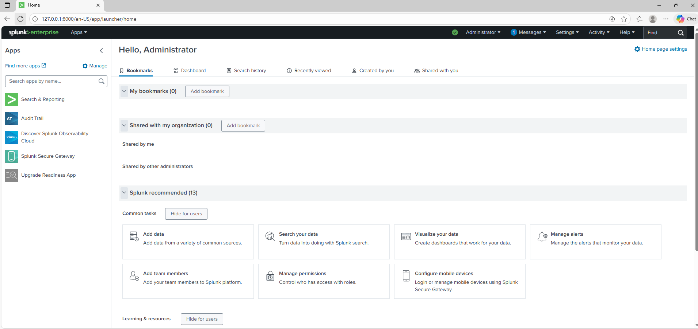
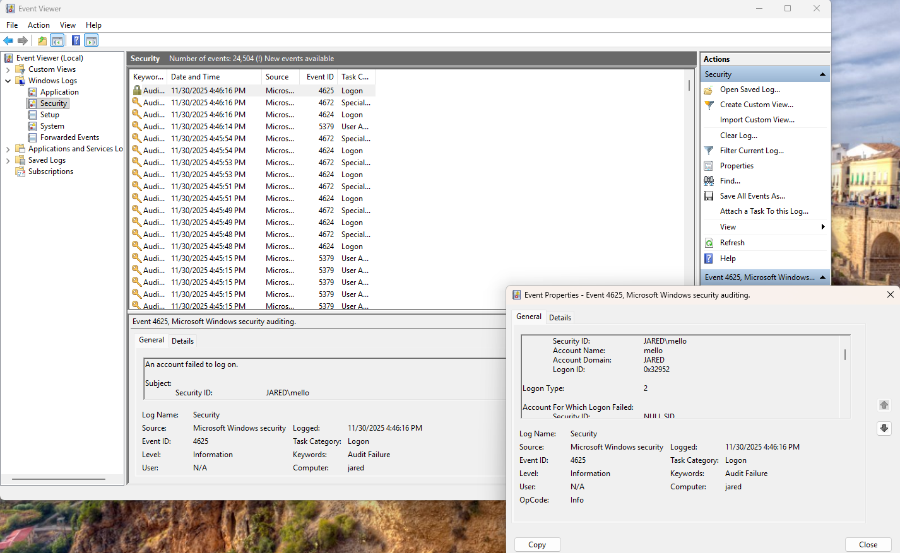

## Step 1: Install Splunk Enterprise
- OS: Windows 11 VM
- Downloaded Splunk Enterprise from official website
- Installed with default settings
- Accessed web UI at http://localhost:8000
- Created admin account

## Step 2: Windows Security Logs
Actions:
- Generated failed logins using lock-screen and runas.
- Observed Event IDs: 4625 (failed), 4624 (success).
Files saved:
- logs/windows/Security.evtx
Screenshots:
- screenshots/XX-event-viewer.png

