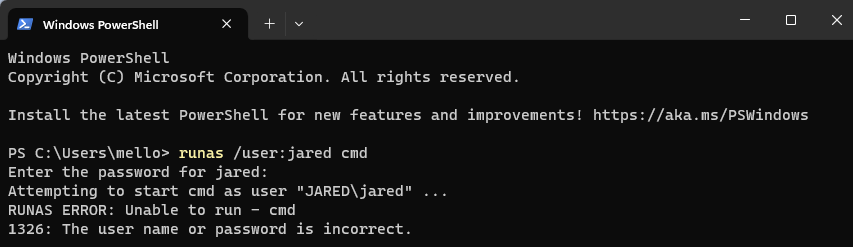
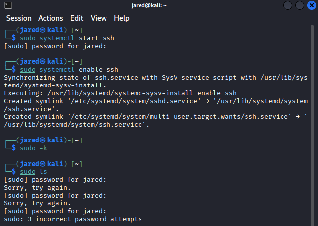
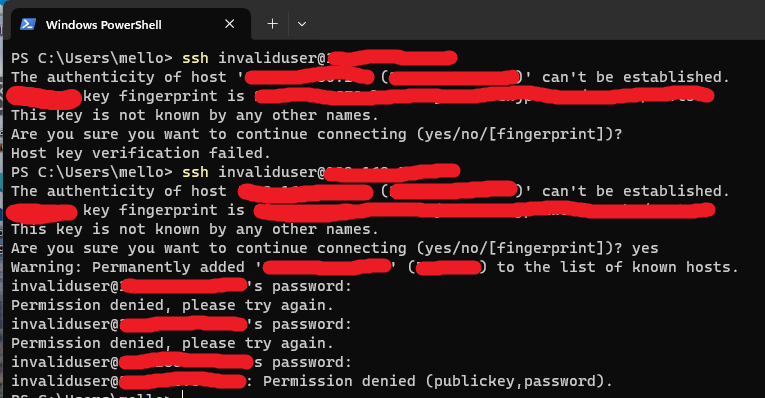
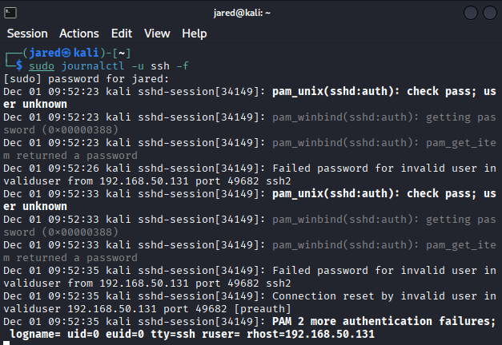

## Step 1: Install Splunk Enterprise
- OS: Windows 11 VM
- Downloaded Splunk Enterprise from official website
- Installed with default settings
- Accessed web UI at http://localhost:8000
- Created admin account

## Step 2: Windows Security Logs
Actions:
- Generated failed logins using lock-screen and runas.
- Observed Event IDs: 4625 (failed), 4624 (success).
Files saved:
- logs/windows/Security.evtx

## Step 3 - Kali Linux Auth Logs
Actions:
- Started SSH service and generated failed SSH login attempts from Windows.
- Generated failed sudo attempts locally.
Files saved:
- logs/linux/ssh_logs.txt
- logs/linux/sudo_logs.txt
Commands used:
- sudo systemctl start ssh
- sudo journalctl -u ssh -f
- nmap -sS <windows-ip>

- Kali SSH Logs

