# My Splunk Home Lab Project

This is my personal documentation for a home lab I built to practice using Splunk as a SIEM. I set up virtual machines, generated security events, and ingested logs into Splunk to analyze and visualize them.

---

## Step 1: Setting Up My Home Lab

I created two VMs in **Oracle VirtualBox**:

- **Windows 11 VM** — this runs Splunk Enterprise and the Universal Forwarder.  
- **Kali Linux VM** — acts as my “attacker” machine to simulate failed logins, sudo failures, SSH brute force, and nmap scans.

When I first created the VMs, both were assigned the **same IP via DHCP**, which caused network conflicts. I solved this by switching both VMs to **Bridged Adapter mode**, allowing them to have unique IPs while still connecting to the internet.

---

### Windows 11 VM Configuration

At first, Windows was lagging and sometimes crashed. I allocated more resources and optimized the settings:

**Hardware & System Settings**
- Base Memory: **4096 MB**  
- Processors: **4**  
- Boot Order: Floppy → Optical → Hard Disk  
- Acceleration: Nested Paging, PAE/NX, Hyper-V Paravirtualization  

**Display**
- Video Memory: 128 MB  
- Graphics Controller: VBoxSVGA  
- 3D Acceleration Enabled  

**Storage:** 300 GB  
**Network:** Bridged Adapter  

I also installed **VirtualBox Guest Additions** to improve performance and memory management.

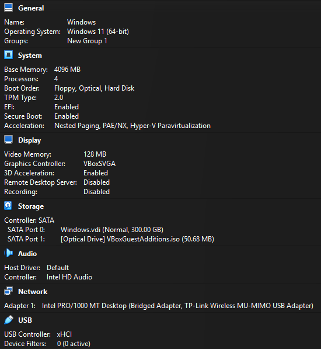

---

### Kali Linux VM Configuration

Kali ran smoothly from the start, so I didn’t have to make many adjustments.

**Hardware & System Settings**
- Base Memory: 4096 MB  
- Processors: 2  
- Boot Order: Optical → Hard Disk  
- Acceleration: Nested Paging, PAE/NX, KVM Paravirtualization  

**Display**
- Video Memory: 128 MB  
- Graphics Controller: VMSVGA  

**Storage:** 25 GB  
**Network:** Bridged Adapter  
  
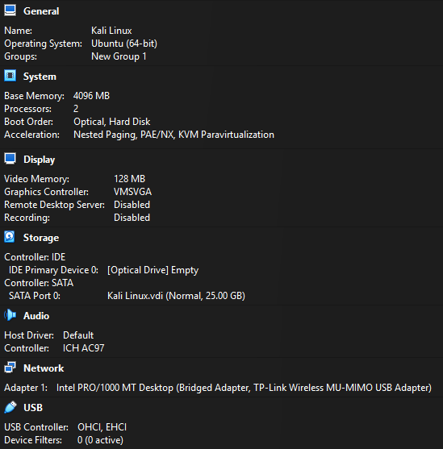

---

## Step 2: Installing Splunk and Configuration

I installed **Splunk Enterprise** on my Windows 11 VM and then set up the **Splunk Universal Forwarder** to send logs to Splunk.

**My Notes:**
- I had to double-check the forwarder configuration and the receiving port on Splunk Enterprise to make sure the connection worked.  
- Once connected, I could start ingesting Windows and Linux logs for analysis.
- Logs can also be uploaded directly via Splunk Web as '.evtx' files.

Actions:
- Installed **Splunk Enterprise**
- Installed **Splunk Universal Forwarder**  
- Enabled Security Event Logs in Windows  
- Configured log forwarding to Splunk Enterprise  

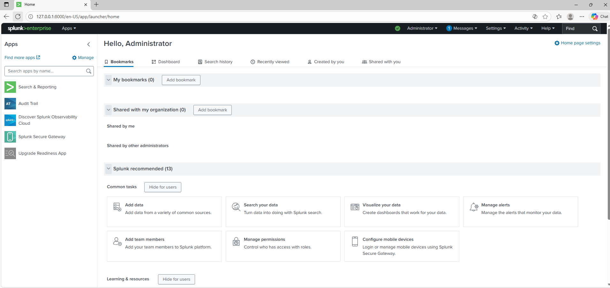

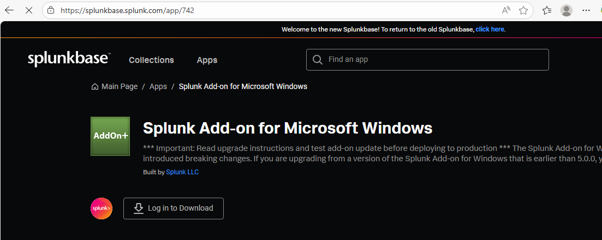
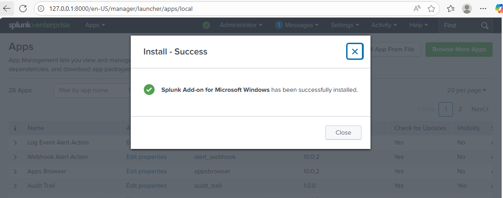
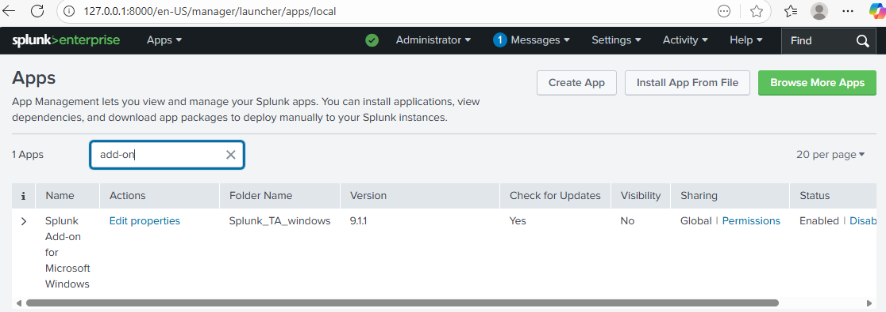

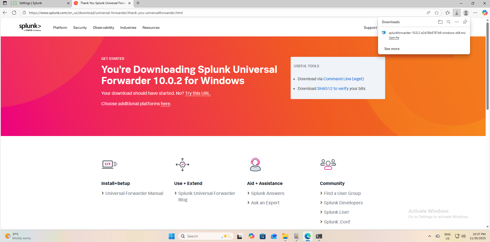
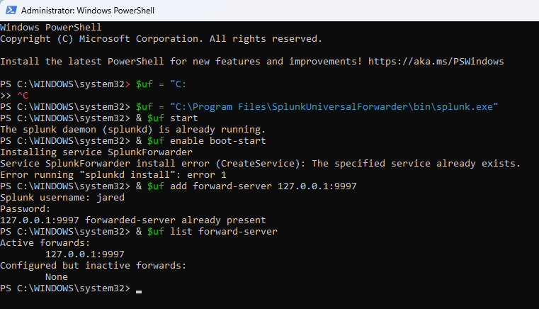
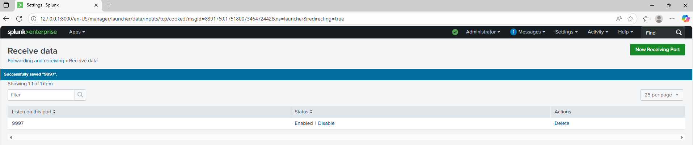

---

## Step 3: Generating Windows Security Events

To simulate user activity and potential attacks, I ran the following command on Windows to generate failed login events:

```
runas /user:wronguser cmd
```

I monitored Windows Event Viewer and focused on:

- **4625** — Failed login  
- **4624** — Successful login  

I exported the logs as `Security.evtx` and `Security.xml` to upload to Splunk later.
  
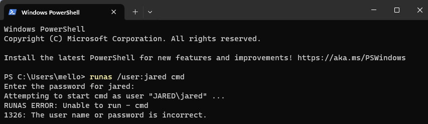
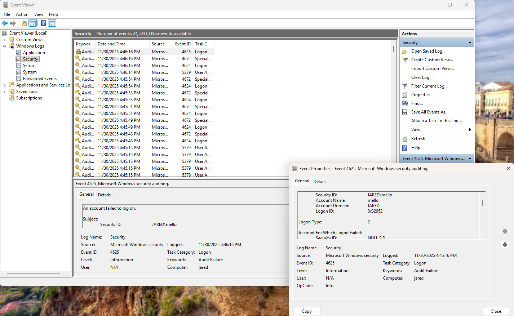

---

## Step 4: Generating Kali Linux Events

### 4.1 Monitoring Authentication Logs

I wanted to simulate attacks and privilege misuse. I used these commands to watch authentication logs in real-time:

```
sudo journalctl -u ssh
sudo journalctl -f
sudo journalctl -xe | grep auth
sudo journalctl -u ssh -f
```

---

### 4.2 Failed Sudo Attempts

To create failed sudo events, I intentionally entered the wrong password multiple times by running this command:

```
sudo su
```

Then I monitored and checked logs by running:

```
sudo journalctl -u sudo -f
```

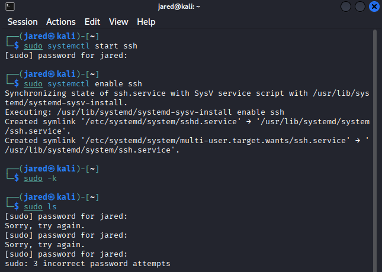

---

### 4.3 SSH Brute Force Attempts

I started the SSH service by running:

```
sudo systemctl start ssh
```

From my Windows VM, I tried logging in as root with incorrect passwords by running:

```
ssh root@<kali-vm-ip>
```

I entered the wrong passwords to generate these logs:

- Invalid user attempts  
- Failed password attempts  
- Authentication failures  

I viewed the logs live using:

```
sudo journalctl -u ssh -f
```

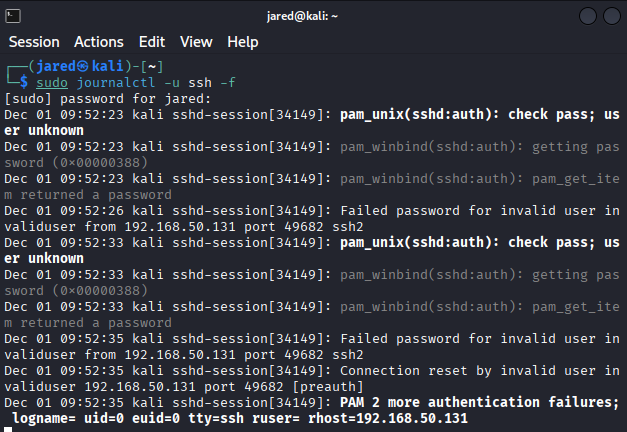
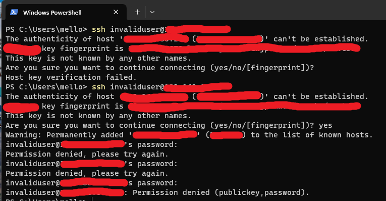

---

### 4.4 Nmap Reconnaissance Scan

I ran a SYN scan from Kali to Windows:

```
nmap -sS <Windows-IP>
```

This triggered and generates Windows firewall events. I checked Event Viewer for:

- **5152**  
- **5156**  
- **5985**  
- **26001**  
- Firewall blocks

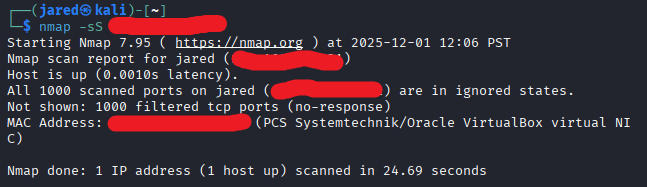

---

## Step 5: Exporting Linux Logs for Splunk

I saved the logs to files so I could ingest them into Splunk:

SSH logs:

```
sudo journalctl --unit=ssh > ssh_logs.txt
```

Sudo logs:

```
sudo journalctl | grep sudo > sudo_logs.txt
```

Saved in:

- `logs/linux/ssh_logs.txt`  
- `logs/linux/sudo_logs.txt`  

---

## Step 6: Upload Logs to Splunk

I uploaded my exported Windows `.evtx` files and Linux `.txt` logs into Splunk and verified that they were properly indexed.  

I used SPL queries to check data:

```
index=home_lab host="<hostname>" | stats count by sourcetype
index=home_lab sourcetype=WinEventLog:Security | stats count by EventCode
```

**Notes:**
- At first, the Windows event logs showed weird formatting (`\x00...`), but exporting them as XML fixed this issue.  
- Linux logs were correctly indexed after saving them as `.txt` files.

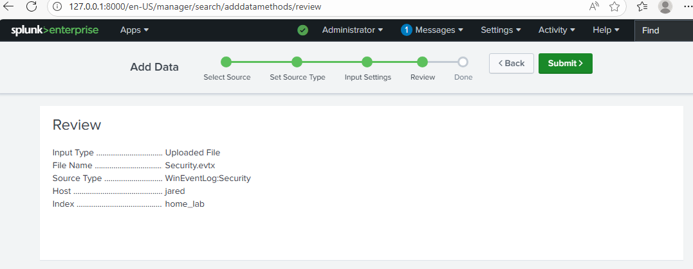
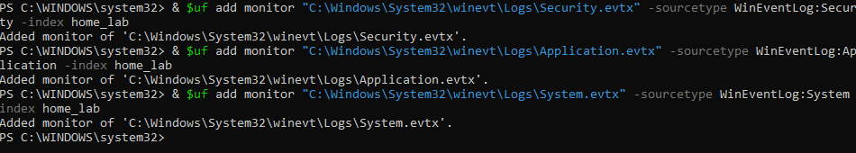

---

## Step 7: Next Steps & Improvements

Now that my lab is set up, I plan to:

- Build dashboards for:
  - Failed logins  
  - Sudo abuse  
  - SSH brute-force attempts  
  - Recon / nmap detection  
- Create alerts for suspicious activity  
- Install **Sysmon** on Windows for advanced logging  
- Add more attacker scenarios for richer dataset  
- Automate log generation scripts for continuous testing  

---
